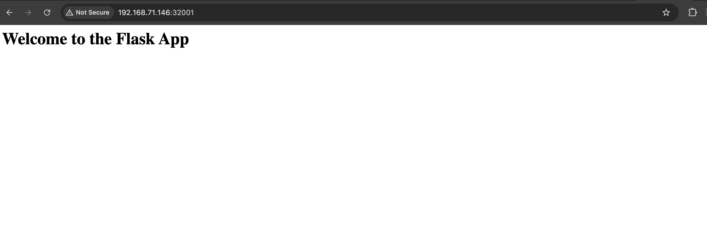

# Building your own docker image
Often in enterpises the standard available images only won't suffice the requirement. Hence you may need to build one of your own.

Now to build your own image you often start with the base image. A base is the image that your image extends. It refers to the contents of the FROM instruction in the Dockerfile.

in docker, we create our own image using **Dockerfile**. A sample dockerfile is present in the repo for reference. 

To use this image follow the below instructions - 

* Download or clone the repo using git clone
```
git clone https://github.com/dpdeepankar/docker-learning-projects.git
```

* Switch to the **Build-your-own-docker-image** directory
```
cd docker-learning-projects/Build-your-own-docker-image/
``` 

* Run *docker build* command to build the image. Here -t flag is used to create the tag v1 of the image.
```
$ docker build -t myapp:v1 .
[+] Building 9.3s (9/9) FINISHED                                                                                                                                                             docker:default
 => [internal] load build definition from Dockerfile                                                                                                                                                   0.0s
 => => transferring dockerfile: 177B                                                                                                                                                                   0.0s
 => [internal] load metadata for docker.io/library/python:3.14.0a7-alpine3.21                                                                                                                          1.6s
 => [internal] load .dockerignore                                                                                                                                                                      0.0s
 => => transferring context: 2B                                                                                                                                                                        0.0s
 => [1/4] FROM docker.io/library/python:3.14.0a7-alpine3.21@sha256:be2ab08ce8046506b57cb62a6b6c6953508d4c93a39eb26bc0e2f65e626df891                                                                    0.0s
 => [internal] load build context                                                                                                                                                                      0.0s
 => => transferring context: 238B                                                                                                                                                                      0.0s
 => CACHED [2/4] WORKDIR /app                                                                                                                                                                          0.0s
 => [3/4] COPY . /app                                                                                                                                                                                  0.0s
 => [4/4] RUN python -m pip install -r requirements.txt                                                                                                                                                7.5s
 => exporting to image                                                                                                                                                                                 0.1s
 => => exporting layers                                                                                                                                                                                0.1s
 => => writing image sha256:6310388d43522307c13264844ef44ccd834761230d4f07f1eb510dbe412cf226                                                                                                           0.0s
 => => naming to docker.io/library/myapp:v1

```

Alternatively you can run from other directory as well without switching the path. Instead of '.' provide the complete path
```
$ docker build -t myapp:v1 docker-learning-projects/Build-your-own-docker-image/
[+] Building 11.1s (9/9) FINISHED                                                                                                                                                            docker:default
 => [internal] load build definition from Dockerfile                                                                                                                                                   0.0s
 => => transferring dockerfile: 177B                                                                                                                                                                   0.0s
 => [internal] load metadata for docker.io/library/python:3.14.0a7-alpine3.21                                                                                                                          3.1s
 => [internal] load .dockerignore                                                                                                                                                                      0.0s
 => => transferring context: 2B                                                                                                                                                                        0.0s
 => [internal] load build context                                                                                                                                                                      0.0s
 => => transferring context: 24.98kB                                                                                                                                                                   0.0s
 => [1/4] FROM docker.io/library/python:3.14.0a7-alpine3.21@sha256:be2ab08ce8046506b57cb62a6b6c6953508d4c93a39eb26bc0e2f65e626df891                                                                    0.0s
 => CACHED [2/4] WORKDIR /app                                                                                                                                                                          0.0s
 => [3/4] COPY . /app                                                                                                                                                                                  0.0s
 => [4/4] RUN python -m pip install -r requirements.txt                                                                                                                                                7.8s
 => exporting to image                                                                                                                                                                                 0.1s
 => => exporting layers                                                                                                                                                                                0.1s
 => => writing image sha256:6c9373d2b5e663e1841616e85c562a4bce9e57873785e5cfdacdd8f04c1c88e9                                                                                                           0.0s
 => => naming to docker.io/library/myapp:v1
```

* The image will be available locally, notice how small is the image size
```
$ docker image ls
REPOSITORY   TAG       IMAGE ID       CREATED          SIZE
myapp        v1        6c9373d2b5e6   18 seconds ago   65.9MB
ubuntu       latest    7fc8925289a8   3 days ago       101MB
```

* Now you can run a container using this image
```
$ docker run --name flaskapp -d myapp:v1
3ad6ec8688df48900e5eac1ff95e24dd8386028f92d9256cdaf26a0357493c9f

$ docker ps
CONTAINER ID   IMAGE      COMMAND              CREATED         STATUS         PORTS      NAMES
3ad6ec8688df   myapp:v1   "python -u app.py"   3 seconds ago   Up 2 seconds   5000/tcp   flaskapp
```


## Bonus
Now that our container is running we would need to access our app as well. For that we will link the container port with the host port. We will cover this concept in next but for now use the belwo command to link container port with host port

```
docker run -p 32001:5000 --name flaskapp -d myapp:v1
```

command breakdown:
* docker : cli to interact with docker daemon
* run: docker command to execute a container
* -p : publish port with syntax <hostPort>:<containerPort>
* --name: [optional] custom name of the container, if not provided docker will automatically assign a random name to the container
* -d:  running the container in the background or in detached mode.
* myapp:v1: name of the image:version or tag of the image

Note: If you used --name flag then before running this command again you need to ensure there are no existing container lying around with the same name else it won't run

Alternatively, if your container exposes only one port then you can publish them all on a random host port. This will save you from hassle of figuring out which host port is free. But there is a catch here. Every time you will spin up the container, it will use a different port hence in enterprise environment, following this method can quickly become problematic as your app will be available on a different port everytime the contianer is restarted. But for lab purpose you can use it.

```
docker run -P --name flaskapp -d myapp:v1
```

Let's see which port the app is running on
```
$ docker ps
CONTAINER ID   IMAGE      COMMAND              CREATED         STATUS         PORTS                                           NAMES
c6143571d559   myapp:v1   "python -u app.py"   3 seconds ago   Up 2 seconds   0.0.0.0:32001->5000/tcp, [::]:32001->5000/tcp   flaskapp
```

In above output if you see the PORTS column, the first part 0.0.0.0:32001 represents the host port whereas the second part 5000/tcp represents the port exposed by the container.
Hence we can access the app on port 32001 of the host. Let's give it a try




