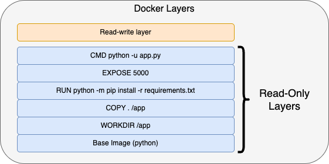

# Volumes in Docker
A container is built from a read-only image that has multiple layers built from each and every command that is run in the dockerfile of the image. Now, once the container is deployed, the layers are stacked with a read-write layer. Everytime you perform a write operation inside the container a new layer is added on top of the image layer. This read-write layer is volatile in nature, meaning the moment container is stopped you lose all the data that is written to the container. 



## Let's do some operation on a container
Lets spin up our python app image and perform some operation like creating a file and storing it. We will then stop, delete and recreate the container to see if the data exist.

```

$ docker ps
CONTAINER ID   IMAGE      COMMAND              CREATED       STATUS       PORTS                                           NAMES
c6143571d559   myapp:v1   "python -u app.py"   2 hours ago   Up 2 hours   0.0.0.0:32001->5000/tcp, [::]:32001->5000/tcp   flaskapp

$ docker exec -it c6143571d559 sh
/app # echo "testing if the read write exist" > tempfile.txt
/app # ls
Dockerfile        README.md         app.py            requirements.txt  tempfile.txt
/app # cat tempfile.txt
testing if the read write exist
/app #
/app # exit

$ docker stop flaskapp
flaskapp

$ docker rm flaskapp
flaskapp

$ docker run -P -d --name flaskapp myapp:v1
058099e5a3c26f177b494deff62965b7100ff1b378b408bfde241e1faa9a0ce2

$ docker exec -it flaskapp sh
/app # ls
Dockerfile        README.md         app.py            requirements.txt
/app #

```

From above output you would have noticed that on recreation of flaskap container the data which we have written is gone. This represents the stateless nature of the container. 

## Data stays on stop/start of the container
Yes, when you do a *docker stop* on a container, it shuts down the container, the container still exist  and hence the read-write filesystem layer persist. Due to this when you do a *docker start* you get your data back.

```
$ docker ps
CONTAINER ID   IMAGE      COMMAND              CREATED       STATUS       PORTS                                           NAMES
c6143571d559   myapp:v1   "python -u app.py"   2 hours ago   Up 2 hours   0.0.0.0:32001->5000/tcp, [::]:32001->5000/tcp   flaskapp

$ docker exec -it c6143571d559 sh
/app # echo "testing if the read write exist" > tempfile.txt
/app # ls
Dockerfile        README.md         app.py            requirements.txt  tempfile.txt
/app # cat tempfile.txt
testing if the read write exist
/app #
/app # exit

$ docker stop flaskapp
flaskapp

$ docker start flaskapp
flaskapp

$ docker exec -it flaskapp sh
/app # ls
Dockerfile        README.md         app.py            requirements.txt  tempfile.txt
/app # cat tempfile.txt
testing if the read write exist
/app #
/app # exit

```

## Why do we need volumes then if the data stays on start stop, why can't we follow this approach in enterprise.
From above, there arise this question that why do we even need volumes if the data can persist across container restarts. Well, in enterprises your application is going to evolve with time. you will enhance your application with new updated versions. Now when you do stop-start of your container, you are not making any changes to the container and hence the container starts exactly how it was intially. But when we want to update the code, image, config on the container, we must delete and recreate the container. In this scenario whatever data we have had written or stored inside our container is lost. Now with certain contianer like database we don't want that. Because losing that can cause lose business, and hence come Volumes into the picture.

Volumes help us store data outside the container, that enables us to keep our data even if we lose our container. All we need to do is map the volume to the new container.


## Lets see how volumes work

There are different volume type that can be attached to a container.
 **1. Volume Bind:** In this we create a volume, which is kept in /var/lib/docker/volumes directory. This volume can be created using *docker volume create* command or if you use either of the belwo commands it will create a empty volume for you if not already exist.

Syntax:
```
docker run --mount type=volume,src=<volume-name>,dst=<mount-path>
docker run --volume <volume-name>:<mount-path>
```

If you mount a non-empty volume into a directory in the container in which files or directories exist, the pre-existing files are obscured by the mount. This is similar to if you were to save files into /mnt on a Linux host, and then mounted a USB drive into /mnt. The contents of /mnt would be obscured by the contents of the USB drive until the USB drive was unmounted.

With containers, there's no straightforward way of removing a mount to reveal the obscured files again. Your best option is to recreate the container without the mount.

If you mount an empty volume into a directory in the container in which files or directories exist, these files or directories are propagated (copied) into the volume by default. Similarly, if you start a container and specify a volume which does not already exist, an empty volume is created for you. This is a good way to pre-populate data that another container needs.

To prevent Docker from copying a container's pre-existing files into an empty volume, use the volume-nocopy option, see Options for --mount.

```
$ docker run --mount type=volume,src=flaskvol,dst=/mnt -d --name flaskapp myapp:v1
a73af35761a3afda3f8217aede2bd5e3b825a50c3ffd03cc723540f7166f4b44

$ docker ps
CONTAINER ID   IMAGE      COMMAND              CREATED         STATUS         PORTS      NAMES
a73af35761a3   myapp:v1   "python -u app.py"   6 seconds ago   Up 6 seconds   5000/tcp   flaskapp

$ docker exec -it flaskapp sh
/app # cd /mnt
/mnt # ls
/mnt # echo "temporary data file" > tempfile.txt
/mnt #
/mnt # cat tempfile.txt
temporary data file
/mnt #
/mnt # ls
tempfile.txt
/mnt #
/mnt # exit

$ docker stop flaskapp ; docker rm flaskapp
flaskapp
flaskapp

# Notice the contianer ID is different then the one before, which shows its a new container.
$ docker run --mount type=volume,src=flaskvol,dst=/mnt -d --name flaskapp myapp:v1
6ec2692a1ddc18dae52859d4c76389be7959202d899f6903ad4bc79c84887415

$ docker exec -it flaskapp sh
/app # cd /mnt
/mnt # ls
tempfile.txt
/mnt # cat tempfile.txt
temporary data file
/mnt # exit

```
On the host machien this volume data is present in the /var/lib/docker directory

```
$ ls -lrt /var/lib/docker
total 8
drwx------  2 root root    6 Apr 11 18:08 runtimes
drwx------  3 root root   17 Apr 11 18:08 plugins
-rw-------  1 root root   36 Apr 11 18:08 engine-id
drwxr-x---  3 root root   19 Apr 11 18:08 network
drwx------  3 root root   22 Apr 11 18:08 image
drwx------  2 root root    6 Apr 11 18:08 swarm
drwx--x--x  5 root root  149 Apr 12 07:07 buildkit
drwx------  2 root root    6 Apr 12 07:36 tmp
drwx-----x  3 root root   66 Apr 12 10:09 volumes
drwx--x--- 24 root root 4096 Apr 12 10:10 overlay2
drwx--x---  4 root root  150 Apr 12 10:10 containers

$ cd /var/lib/docker/volumes
$
$ ls -lrt
total 24
brw------- 1 root root 253, 0 Apr 11 18:08 backingFsBlockDev
-rw------- 1 root root  32768 Apr 12 10:09 metadata.db
drwx-----x 3 root root     19 Apr 12 10:09 flaskvol

$ cd flaskvol/
$ ls -rlt
total 0
drwxr-xr-x 2 root root 26 Apr 12 10:09 _data
$ cd _data
$ ls -lrt
total 4
-rw-r--r-- 1 root root 20 Apr 12 10:09 tempfile.txt
$ cat tempfile.txt
temporary data file

```

You can list all the created volumes as well using *docker volumes ls* command.

```
$ docker volume ls
DRIVER    VOLUME NAME
local     flaskvol

```

you can also check the metadata of the volume in JSON format to get more details of volume
```
$ docker inspect flaskvol
[
    {
        "CreatedAt": "2025-04-12T10:09:03Z",
        "Driver": "local",
        "Labels": null,
        "Mountpoint": "/var/lib/docker/volumes/flaskvol/_data",
        "Name": "flaskvol",
        "Options": null,
        "Scope": "local"
    }
]
```

**2. Host path Bind:** In this we bind a directory on the host with a directory on the container. This is recommended when you want to share the contents between host and container.

Syntax:
```
docker run --mount type=bind,src=<host-path>,dst=<container-path>
docker run --volume <host-path>:<container-path>
```
Lets try out host path bind

```
# first lets see the contents of the host directory /tmp
$ ls -lrt /tmp
total 0
drwx------ 3 root root 17 Apr 11 17:47 systemd-private-16c5ab943fae4a1fa0da61c047e33283-systemd-timesyncd.service-GLb4p9
drwx------ 2 root root  6 Apr 11 17:47 vmware-root_715-4281843213
drwx------ 3 root root 17 Apr 11 17:47 systemd-private-16c5ab943fae4a1fa0da61c047e33283-systemd-resolved.service-AGVHeR
drwx------ 3 root root 17 Apr 11 17:47 systemd-private-16c5ab943fae4a1fa0da61c047e33283-systemd-logind.service-VPW4c4
drwx------ 3 root root 17 Apr 11 17:47 systemd-private-16c5ab943fae4a1fa0da61c047e33283-ModemManager.service-2RbLMy
drwx------ 3 root root 22 Apr 11 17:47 snap-private-tmp

# Running the flask app container with mounting /tmp from host.
$ docker run --mount type=bind,src=/tmp,dst=/mnt -d -P --name flaskapp myapp:v1
f143feb5a82a72a3c4314814cc458bd15755057e9401584dfb66369dd98277b4

$ docker exec -it flaskapp sh
/app # cd /mnt

# Here we can see the same content on the mounted path.
/mnt # ls -rlt
total 0
drwx------    3 root     root            17 Apr 11 17:47 systemd-private-16c5ab943fae4a1fa0da61c047e33283-systemd-timesyncd.service-GLb4p9
drwx------    2 root     root             6 Apr 11 17:47 vmware-root_715-4281843213
drwx------    3 root     root            17 Apr 11 17:47 systemd-private-16c5ab943fae4a1fa0da61c047e33283-systemd-resolved.service-AGVHeR
drwx------    3 root     root            17 Apr 11 17:47 systemd-private-16c5ab943fae4a1fa0da61c047e33283-systemd-logind.service-VPW4c4
drwx------    3 root     root            17 Apr 11 17:47 systemd-private-16c5ab943fae4a1fa0da61c047e33283-ModemManager.service-2RbLMy
drwx------    3 root     root            22 Apr 11 17:47 snap-private-tmp
/mnt #

#Now if we add a file here it will also be accessible on the hostpath
/mnt # echo "data addedd to /tmp/ directory from the container" > container_created_file.txt
/mnt #
/mnt # exit

# checking on the host
$ ls -lrt /tmp
total 4
drwx------ 3 root root 17 Apr 11 17:47 systemd-private-16c5ab943fae4a1fa0da61c047e33283-systemd-timesyncd.service-GLb4p9
drwx------ 2 root root  6 Apr 11 17:47 vmware-root_715-4281843213
drwx------ 3 root root 17 Apr 11 17:47 systemd-private-16c5ab943fae4a1fa0da61c047e33283-systemd-resolved.service-AGVHeR
drwx------ 3 root root 17 Apr 11 17:47 systemd-private-16c5ab943fae4a1fa0da61c047e33283-systemd-logind.service-VPW4c4
drwx------ 3 root root 17 Apr 11 17:47 systemd-private-16c5ab943fae4a1fa0da61c047e33283-ModemManager.service-2RbLMy
drwx------ 3 root root 22 Apr 11 17:47 snap-private-tmp
-rw-r--r-- 1 root root 50 Apr 12 10:34 container_created_file.txt

$ cat /tmp/container_created_file.txt
data addedd to /tmp/ directory from the container
```

**3. tmpfs mount:** If you're running Docker on Linux, you have a third option: tmpfs mounts. When you create a container with a tmpfs mount, the container can create files outside the container's writable layer. As opposed to volumes and bind mounts, a tmpfs mount is temporary, and only persisted in the host memory. When the container stops, the tmpfs mount is removed, and files written there won't be persisted. tmpfs mounts are best used for cases when you do not want the data to persist either on the host machine or within the container. This may be for security reasons or to protect the performance of the container when your application needs to write a large volume of non-persistent state data.

Syntax:
```
docker run --mount type=tmpfs,dst=<mount-path>
docker run --tmpfs <mount-path>
```
